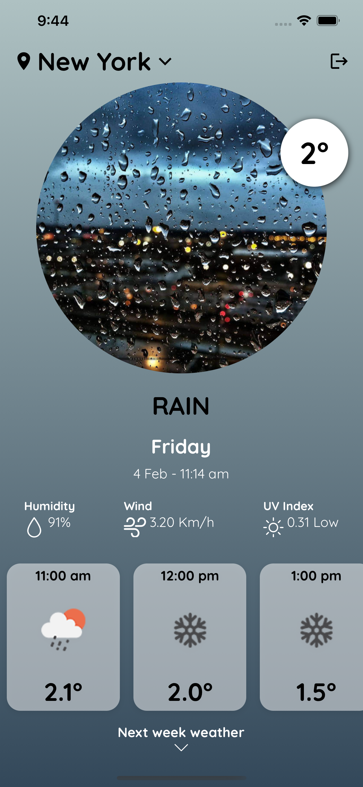
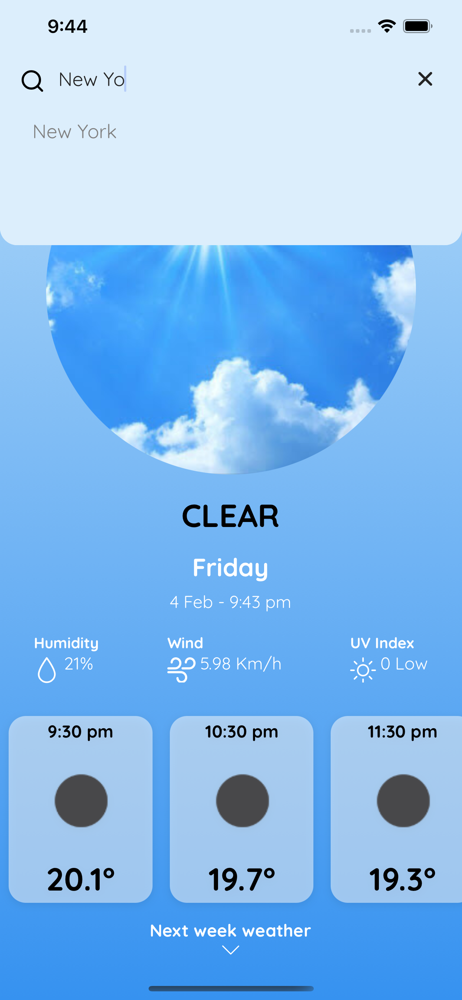
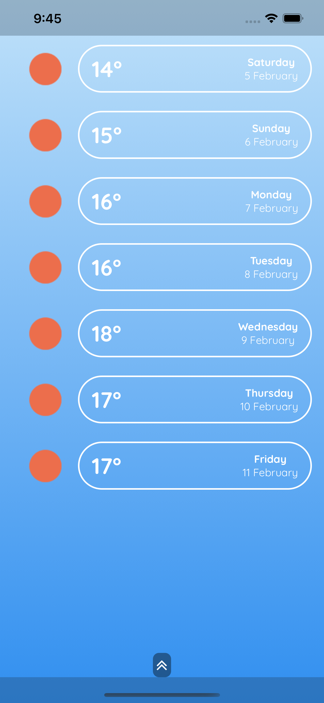
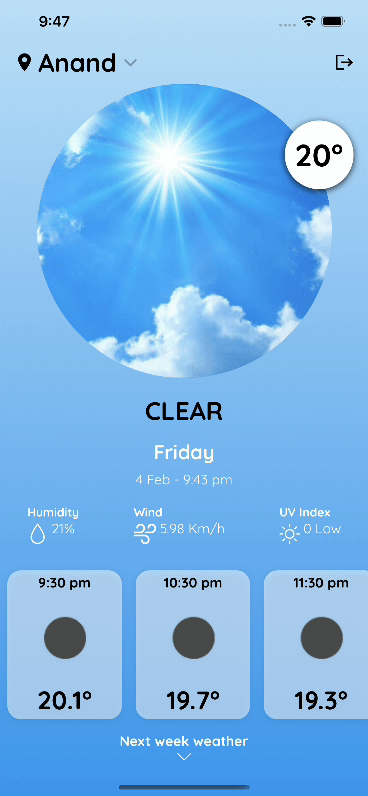
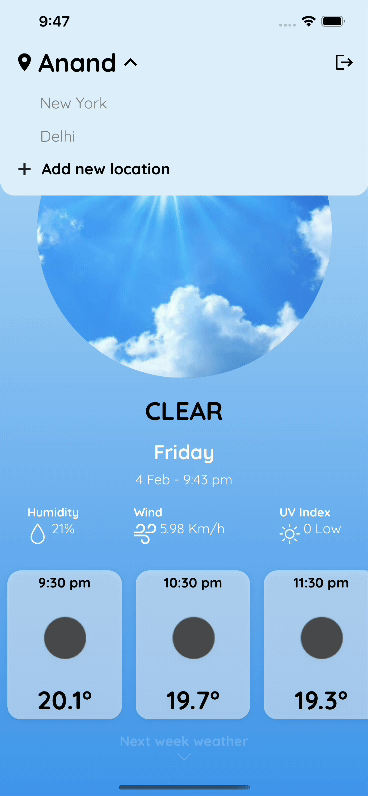

# weather-native
Weather app that shows live weather for current location as well as many cities over the world. Built with React Native bare workflow.

## Features
Get hourly weather, weekly weather and time for current location. Get weather and time information for many cities over the world. Add cities to your bookmarks which are synced on the cloud. Weather-themed ui and attractive animations.

## Top libraries used
React Native Elements, Expo, React Navigation, React Native Firebase, Formik, Yup, Date Fns Tz, Axios, React Native Reanimated

## See also
- Server code: https://github.com/death14stroke/weather-native-server
- UX inspired: https://www.behance.net/gallery/116972093/Weather-app

## Outputs

| | | |
|:-------------------------:|:-------------------------:|:-------------------------:|
 Signup to use |  Login if you are an existing user |
| Weather information with attractive theme |  Search cities and bookmark from all over the world |
|  Get current week weather |  Spring search animation |
|  Expanding header animation |  Bottom sheet for weekly weather |
