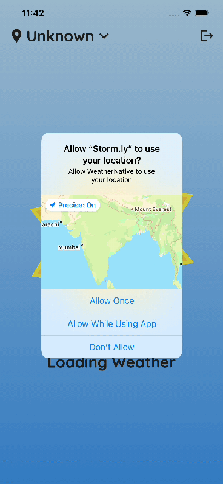
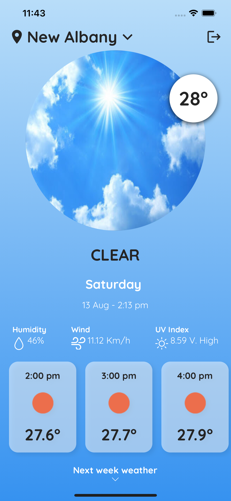
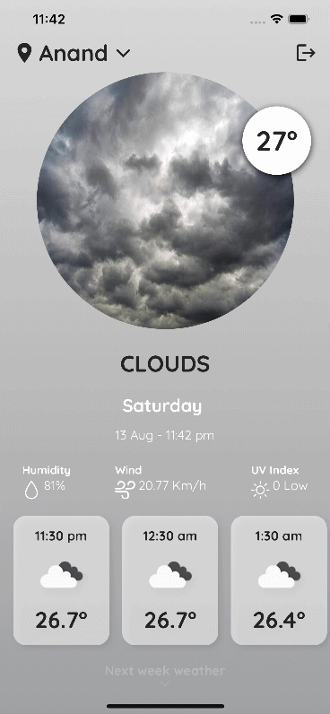
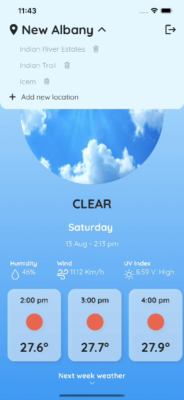
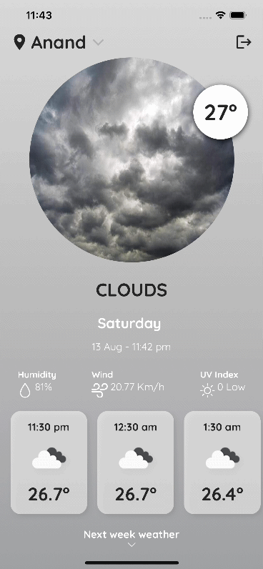

# weather-native-new

Weather application using React Native and Open Weather API in Express JS. Made with bare workflow and fully compatible on Android and iOS. Gets current weather and upto next 7 days weather for gps location as well as for hundreds of cities of the world. Attractive theme for each kind of weather

## See also

-   Server code: https://github.com/death14stroke/weather-native-server
-   UX inspired: https://www.behance.net/gallery/116972093/Weather-app

## Android apk

```
npx mkdirp android/app/src/main/assets/ && react-native bundle --platform android --dev false --entry-file index.js --bundle-output android/app/src/main/assets/index.android.bundle --assets-dest android/app/src/main/res/
```

Alternatively, [download]("https://github.com/death14stroke/weather-native-new/blob/main/outputs/stormly-release.apk") the apk.

## Outputs

|                                                                                                     |                                                                                                    |     |
| :-------------------------------------------------------------------------------------------------: | :------------------------------------------------------------------------------------------------: | :-: |
|         <br>Attractive splash screen         |       <br> Attractive sign up screen        |
|         <br>Complete weather insights          |         <br>Theme for every weather          |
|       <br>Get upcoming week's insights       | <br> Search for the top cities in the world |
| <br>Save your favourite cities for reference |            <br>Search animation             |
